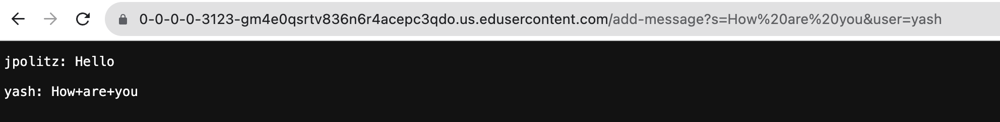

Part 1

Above are my code for the ChatServer and two screenshots of using /add-message.

For the first screenshot
Methods called: The handleRequest method in the ChatHandler class.
Relevant Arguments:
The relevant argument to the handleRequest method is the URL url perameter. 
The chatHistory field of the ChatHandler class is relevant as it stores the chat messages.
Relevant Fields:
chatHistory: Initially empty, it gets updated to include the message "jpolitz: Hello" after processing the request.
Changes to relevant fields:
The chatHistory field is updated to "jpolitz: Hello\n\n" after processing the request.
Explanation: The chatHistory field starts as an empty string. When the /add-message request is received with the parameters "s=Hello" and "user=jpolitz", the handleRequest method concatenates the user and message with a colon and a newline character and appends it to the chatHistory.

For the second screenshot,
Methods called:
The handleRequest method in the ChatHandler class is called.
Relevant Arguments:
The relevant argument to the handleRequest method is the URL url perameter.
The chatHistory field of the ChatHandler class is relevant as it stores the chat messages.
Relevant Fields:
chatHistory: It contains the previous message "jpolitz: Hello\n\n" from the first request.
Changes to relevant fields:
The chatHistory field is updated to "jpolitz: Hello\n\n yash: How+are+you\n\n" after processing the request.
Explanation: The chatHistory field already contained the previous message "jpolitz: Hello\n\n". When the second /add-message request is received with the parameters "s=How+are+you" and "user=yash", the handleRequest method appends the new message "yash: How+are+you" to the existing chatHistory.

Part 2

First is the absolute path to the private key for my SSH key for logging into ieng6.

This picture shows the path to the public key for my SSH key for logging into ieng6.

This is the terminal interaction where I logged into my ieng6 account without being asked for a password.

Part 3
In the lab of 2 and 3, I learnt quite a lot of things I haven't learnt before. In the lab2, I learnt how to build and run a server which I haven't done before. I think it's really cool and got a sense of achievement after making the first"Searching Engine" with the help of classmates and teaching assisstants. Besides, since I haven't learnt java before, I also learnt how to use javac and java to complie and to run a program. In the lab 3, I learnt to set up SSH keys for easy access in which I can log into my ieng6 account without using my password which is really convenient!!Although I lack some basic knowledge for this class, I think I can do well in it with more efforts!
